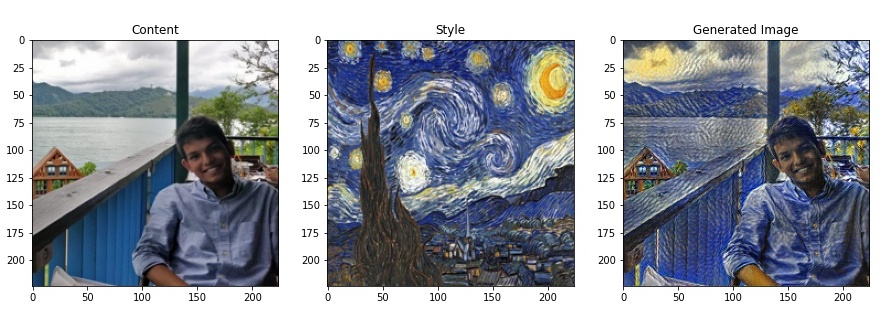

# Style Transfer
Pytorch Implementation of Neural Style Transfer based on the paper, <a href = "https://arxiv.org/pdf/1508.06576.pdf">A Neural Algorithm of Artistic Style</a>.



### Requirements
* torch
* torchvision
* PIL

### Usage
```
python StyleTransfer.py --content-path [path to content image] --style-path [path to style image]
```

Run `python StyleTransfer.py -h` for optional arguments

### Some Implementation Points (from the paper)
* Use LBFGS as optimizer. Adam or SGD optimizer do not give sharp outputs.
* Remember to normalize input (using mean and std of vgg input) and denormalize output
* Keep ratio of style_wt to content_wt more than 10, preferably around 100. 

### References
1. Neural Style Transfer Pytorch Tutorial https://pytorch.org/tutorials/advanced/neural_style_tutorial.html#loss-functions
2. Style Transfer https://github.com/djin31/StyleTransfer
